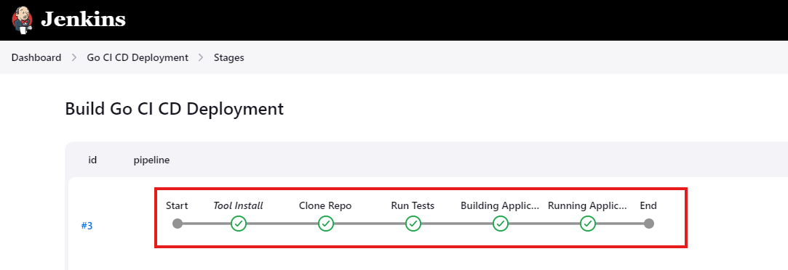
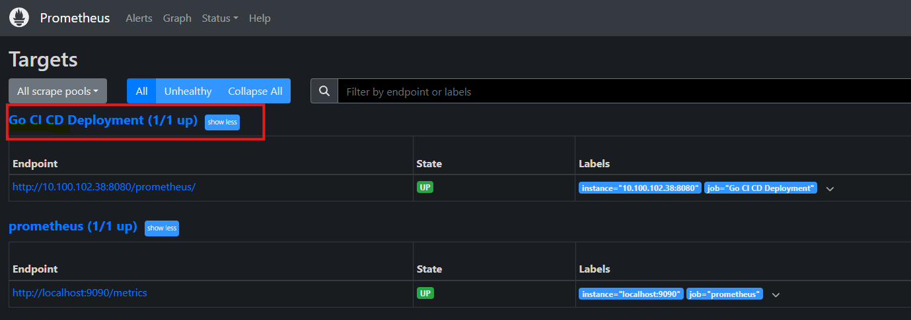

# CI-CD-Go-Jenkins-Pipeline-Monitoring
GoCI/CDFlow is a streamlined CI/CD pipeline project that automates the Testing building and deployment of Go applications using Jenkins and Docker. It clones a Go repository, builds a Docker image, and runs the application in a container, showcasing an efficient continuous integration and delivery process.

# GoCI/CDFlow

GoCI/CDFlow is a CI/CD pipeline project designed to automate the Testing, building and deployment of a simple Go application using Jenkins and Docker. This project showcases the integration of Jenkins, Docker, and Go in a seamless CI/CD process.

## Tools Used

- **Jenkins**: An open-source automation server that facilitates continuous integration and continuous delivery (CI/CD).
- **Go**: A statically typed, compiled programming language designed for simplicity and efficiency.
- **Docker**: A platform for developing, shipping, and running applications in containers.
- **Promethues**: rometheus is an open-source systems monitoring and alerting toolkit that provides powerful querying features and flexible alerting options.

## Setting Up Jenkins Server + Docker Engine

To set up Jenkins and Docker on your server, run the following bash script:

```bash
#!/bin/bash

# Step 1: Update and upgrade the package list
echo "Updating package list and upgrading installed packages..."
apt update && sudo apt upgrade -y

# Step 2: Install Java and Fontconfig
echo "Installing OpenJDK 17 and fontconfig..."
apt-get install -y fontconfig openjdk-17-jre

# Verify Java installation
echo "Verifying Java installation..."
java -version

# Step 3: Add the Jenkins Repository
echo "Adding the Jenkins GPG key and repository..."
wget -O /usr/share/keyrings/jenkins-keyring.asc https://pkg.jenkins.io/debian-stable/jenkins.io-2023.key

echo "Adding Jenkins repository entry..."
echo "deb [signed-by=/usr/share/keyrings/jenkins-keyring.asc] https://pkg.jenkins.io/debian-stable binary/" | sudo tee /etc/apt/sources.list.d/jenkins.list > /dev/null

# Step 4: Install Jenkins
echo "Updating package list and installing Jenkins..."
apt update && sudo apt install -y jenkins

# Step 5: Start and enable Jenkins service
echo "Starting Jenkins service..."
systemctl start jenkins

echo "Enabling Jenkins to start at boot..."
systemctl enable jenkins

# Step 6: Adjust the Firewall
echo "Allowing Jenkins through the firewall on port 8080..."
ufw allow 8080
ufw allow 8081

echo "Checking firewall status..."
ufw status

echo "Jenkins installation and setup complete!"

# Install required packages for Docker
echo "Installing required packages for Docker..."
apt install apt-transport-https ca-certificates curl software-properties-common -y

# Add Docker’s official GPG key
echo "Adding Docker’s official GPG key..."
curl -fsSL https://download.docker.com/linux/ubuntu/gpg | sudo gpg --dearmor -o /usr/share/keyrings/docker-archive-keyring.gpg

# Add Docker repository
echo "Adding Docker repository..."
echo "deb [arch=amd64 signed-by=/usr/share/keyrings/docker-archive-keyring.gpg] https://download.docker.com/linux/ubuntu $(lsb_release -cs) stable" | sudo tee /etc/apt/sources.list.d/docker.list > /dev/null

# Update package database with Docker packages
echo "Updating package database..."
apt update -y

# Install Docker
echo "Installing Docker..."
apt install docker-ce -y

# Start and enable Docker
echo "Starting and enabling Docker service..."
systemctl start docker
systemctl enable docker
```

# Jenkins Setup for Docker and Go Pipeline

## Initial Jenkins Setup

Once Jenkins is installed, visit `http://your-server-ip:8080` for the initial setup.

### Required Plugins

On Jenkins, install the following plugins:

- Docker API
- Docker Commons
- Docker Pipeline
- Docker
- Go
- Prometheus Metrics

**Note:** After installing these plugins, a restart is required.

### Docker Permissions for Jenkins

To allow Jenkins to run Docker commands, add the Jenkins user to the Docker group with the following command:

```bash
sudo usermod -aG docker jenkins
```

## Restart Jenins Server 

```bash
sudo systemctl restart jenkins
```
# Jenkins CI/CD Pipeline for Go Application

Before you begin, make sure Jenkins is up and running, and you have Docker installed on the server where Jenkins is running.

## Setting Up the Pipeline

Once Jenkins is up and running, follow these steps:

1. **Configure Go in Jenkins:**
   - Go to **"Manage Jenkins"** > **"Global Tool Configuration"**.
   - Add a new Go installation and name it `go-1.23.0` (or the version you are using).

2. **Create a New Pipeline Job:**
   - Go to **"New Item"**, enter a name for your job, and choose **"Pipeline"**.
   - Scroll down to the **"Pipeline"** section and paste the following script:

  
 ```
   pipeline {
       agent any
       tools {
           go 'go-1.23.0'
       }
       environment {
           GO111MODULE = 'off'
       }
       stages {
           stage('Clone Repo') {
               steps {
                   // Get the code from a GitHub repository
                   git branch: 'main', url: 'https://github.com/osherjnks/go-app.git'
               }
           }

           stage('Building Application Image') {
               steps {
                   script {
                       // Build the Docker image
                       app = docker.build("osherjnks/go-webapp-sample")
                   }
               }
           }

           stage('Running Application') {
               steps {
                   script {
                       // Run the Docker container
                       app.run("-p 8081:8081")
                   }
               }
           }
       }
   }
```
## Save and Build

Save the pipeline and click **"Build Now"**.

## What Does the Pipeline Do?

The pipeline performs the following tasks:

- **Clone the Repository:** Clones the Go application from the GitHub repository.
- **Test the Code:** The test stage in the pipeline ensures code quality, catches issues early, and moves only verified code forward.
- **Build Docker Image:** Builds a Docker image using the `Dockerfile` and `hello-world.go` provided in the repository.
- **Run the Application:** Runs the application in a Docker container, exposing it on port `8081`.



## Accessing the Application

After the build completes, you can access the application by navigating to `http://your-server-ip:8081` in your web browser.


# Prometheus Setup on Ubuntu

This guide provides a step-by-step process for setting up Prometheus on an Ubuntu server, tailored for DevOps professionals who need to monitor jobs and services effectively. Prometheus is an open-source systems monitoring and alerting toolkit that provides powerful querying features and flexible alerting options.

To set up Prometheus on your server, run the following bash script:

```bash
#!/bin/bash

# Step 1: Update System Packages
echo "Updating system packages..."
apt update -y
apt upgrade -y


# Proceed with other provisioning steps...

# Step 2: Create a System User and Group for Prometheus
echo "Creating Prometheus group and user..."
groupadd --system prometheus
useradd -s /sbin/nologin --system -g prometheus prometheus

# Step 3: Create Directories for Prometheus
echo "Creating directories for Prometheus..."
mkdir /etc/prometheus
mkdir /var/lib/prometheus

# Step 4: Download Prometheus and Extract Files
echo "Downloading Prometheus version 2.54.0..."
wget https://github.com/prometheus/prometheus/releases/download/v2.54.0/prometheus-2.54.0.linux-amd64.tar.gz


echo "Extracting Prometheus..."
tar vxf prometheus*.tar.gz

# Step 5: Move the Binary Files & Set Owner
echo "Moving Prometheus binaries and setting ownership..."
cd prometheus*/
mv prometheus /usr/local/bin/
mv promtool /usr/local/bin/
chown prometheus:prometheus /usr/local/bin/prometheus
chown prometheus:prometheus /usr/local/bin/promtool

# Step 6: Move the Configuration Files & Set Owner
echo "Moving Prometheus configuration files and setting ownership..."
mv consoles /etc/prometheus
mv console_libraries /etc/prometheus
mv prometheus.yml /etc/prometheus
chown prometheus:prometheus /etc/prometheus
chown -R prometheus:prometheus /etc/prometheus/consoles
chown -R prometheus:prometheus /etc/prometheus/console_libraries
chown -R prometheus:prometheus /var/lib/prometheus

# Step 7: Create Prometheus Systemd Service
echo "Creating Prometheus systemd service file..."
sudo bash -c 'cat <<EOF > /etc/systemd/system/prometheus.service
[Unit]
Description=Prometheus
Wants=network-online.target
After=network-online.target

[Service]
User=prometheus
Group=prometheus
Type=simple
ExecStart=/usr/local/bin/prometheus \\
    --config.file /etc/prometheus/prometheus.yml \\
    --storage.tsdb.path /var/lib/prometheus/ \\
    --web.console.templates=/etc/prometheus/consoles \\
    --web.console.libraries=/etc/prometheus/console_libraries

[Install]
WantedBy=multi-user.target
EOF'

# Step 8: Reload Systemd
echo "Reloading systemd to apply the new Prometheus service..."
systemctl daemon-reload

# Step 9: Start and Enable Prometheus Service
echo "Enabling and starting Prometheus service..."
systemctl enable prometheus
systemctl start prometheus

# Step 10: Check Prometheus Service Status
echo "Checking Prometheus service status..."
systemctl status prometheus

# Step 11: Allow Prometheus Port on Firewall
echo "Allowing Prometheus port (9090) through the firewall..."
ufw allow 9090/tcp
```
## Accessing Prometheus

After the Script completes, you can access the application by navigating to `http://your-server-ip:9090` in your web browser.

# Adding Jenkins Server to Prometheus

## Overview

This guide will walk you through the process of adding your Jenkins server to Prometheus for monitoring.

## Prerequisites

- You must have access to the Prometheus server.
- Ensure Jenkins is running on your specified target IP and port.
- Promethues Metrics Plugin should be install on your Jenkins server/

## Steps to Add Jenkins to Prometheus

### 1. Verify Prometheus Targets

On your Prometheus server, navigate to **Status** -> **Targets**. You should see the server itself listed among the targets.

### 2. Edit Prometheus Configuration

To add your Jenkins server, follow these steps:

1. Open the Prometheus configuration file:

   ```bash
   sudo vim /etc/prometheus/prometheus.yml
   
### 1. Edit Prometheus Configuration

Add the following configuration under `scrape_configs`:

```yaml
- job_name: 'your job name'
  metrics_path: '/prometheus/'
  static_configs:
    - targets: ['your_ip_server:8080']
```
### 2. Restart Prometheus
After updating the configuration file, restart Prometheus to apply the changes:

```bash
sudo systemctl restart prometheus
```

### 3.Verify Jenkins Target in Prometheus UI
Wait a few seconds for the Jenkins job to appear as "UP" in the Prometheus UI under **Status** -> **Targets**. You should see the Jenkins server listed among the targets.



